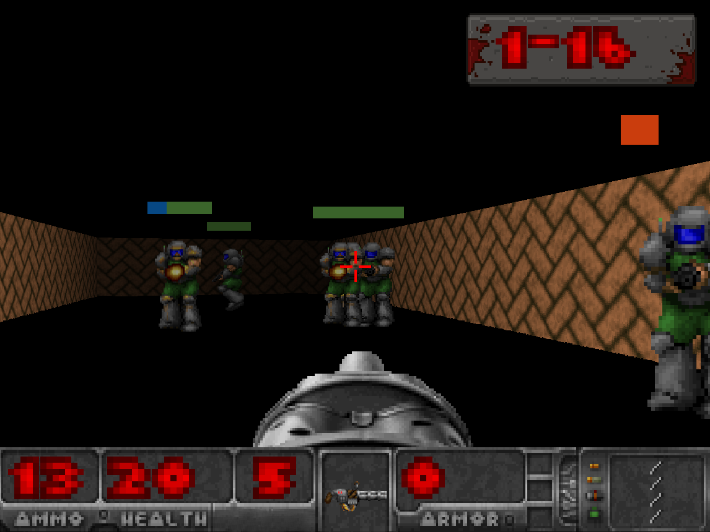

# LCOM Project

LCOM Project for group T4G01.

Group members:
 
1. Andre Moreira (up201904721@fe.up.pt)
2. Nuno Alves (up201908250@fe.up.pt)

## Project Description

OPERATION MINIX is a Doom-like shooter game designed specifically for the MINIX operating system. The objective of the game is to navigate through a level and reach the end before the time limit expires. Players must strategically avoid enemies and engage in combat when necessary. Moreover, various items and pickups such as ammo, health, and armor can be collected along the way.

The game utilizes raycasting techniques to render the 3D world. It also features a multiplayer mode, where two players can compete and fight each other, through the use of serial ports.

## Getting Started

This project was developed exclusively for the MINIX operating system as part of the LCOM course at FEUP. You probably won't have much luck running it on other operating systems, including newer versions of MINIX.

## Game Controls

- **WASD** - Move the player
- **Mouse** - Look around horizontally
- **LEFT MOUSE BUTTON** - Shoot
- **Walking into a pickup** - Collect the item
